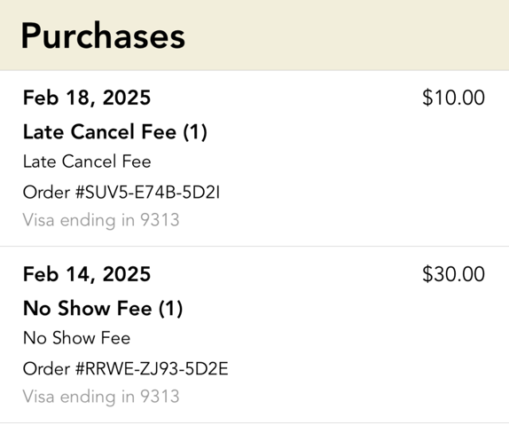

# yoga-with-no-fees

A tool for preventing yoga class fees. Exports yoga events and sends them to your calendar so 
you know about them.



### Setup

Works on Python 3.10
```bash
pip install -r requirements.txt
```

### Future Ideas / Enhancements
* handle "Reservation canceled" by skipping them and removing them from the calendar
* stop creating redundant calendar events when run multiple times
* intuit year in get_date

## User experience


## Generate and yoga class time on LED grid
```bash
# takes up to 20 seconds to copy
scp output.ppm pi@jampi.local:~/

ssh pi@jampi.local
sudo rpi-rgb-led-matrix/examples-api-use/demo -D 1 output.ppm --led-no-hardware-pulse --led-rows=16 --led-cols=32 -m 0 --led-brightness=50
```

